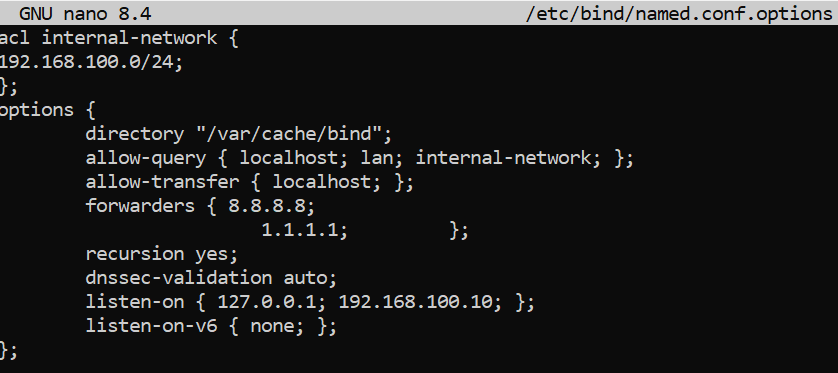
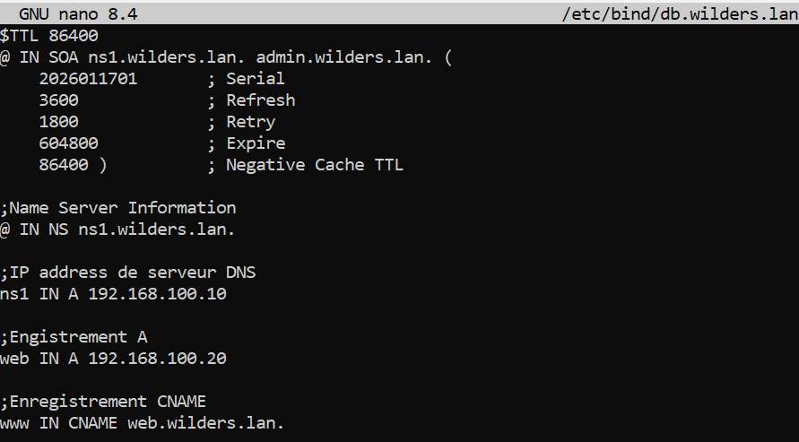
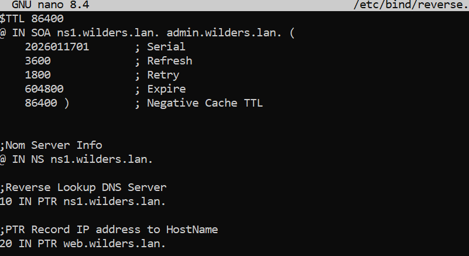
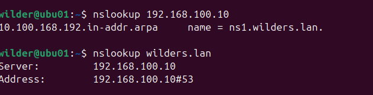

## Quête DNS avec Serveur Debian

#### 1 Configuration du fichier named.conf

   
---  
#### 2 Configuration du fichier de named.conf.local du serveur

 
---  
#### 3 Configuration du fichier de la forward zone du serveur

 

---
#### 4 Configuration du fichier de la reverse zone du serveur

  
---  
#### 5 Les Résultats de la commande nslookup depuis le client vers le serveur DNS

  
